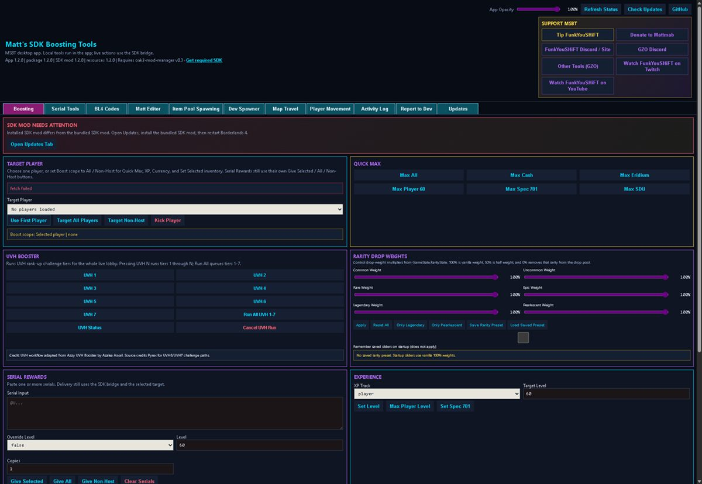
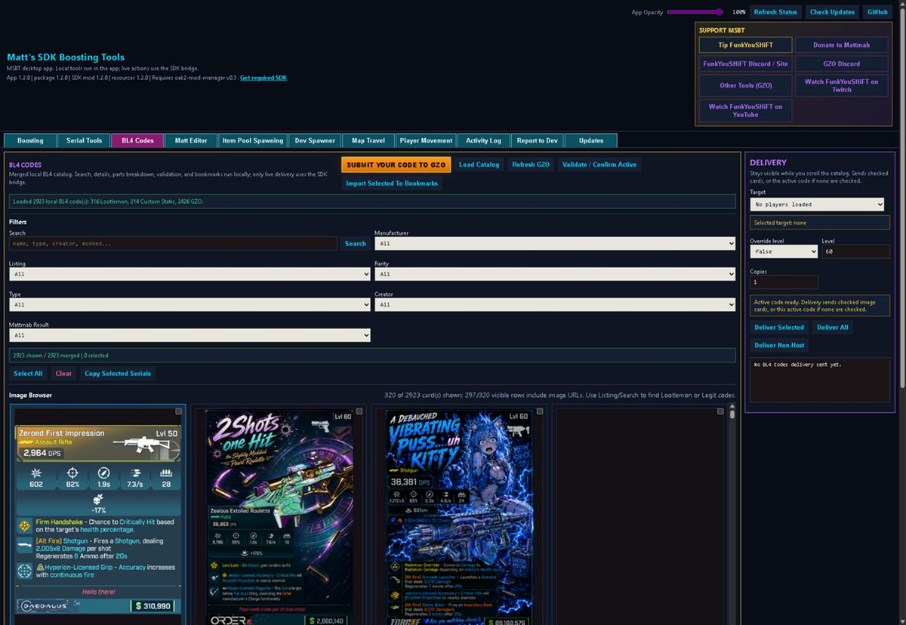
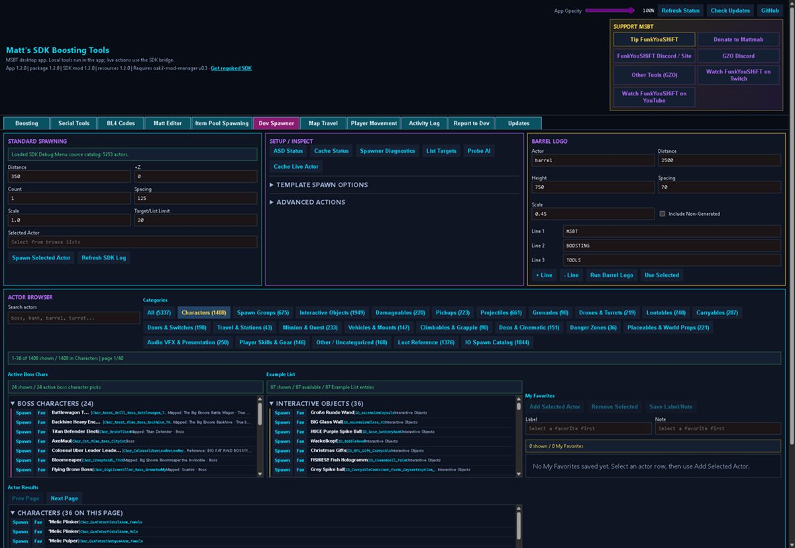
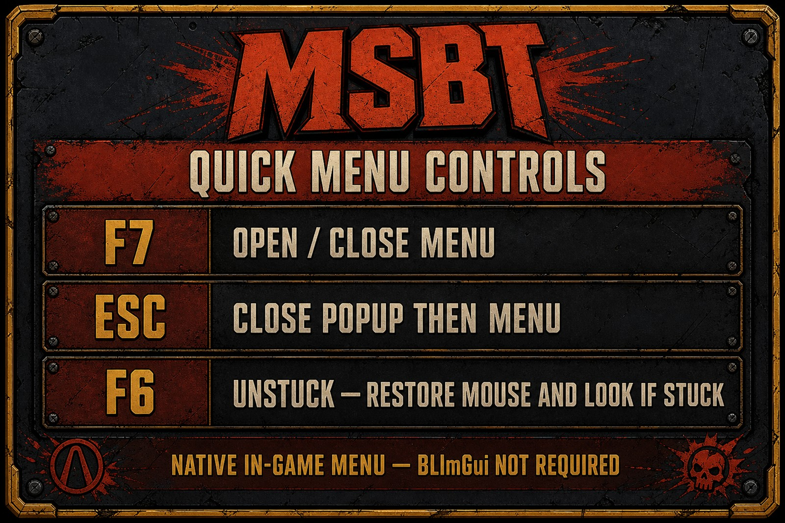
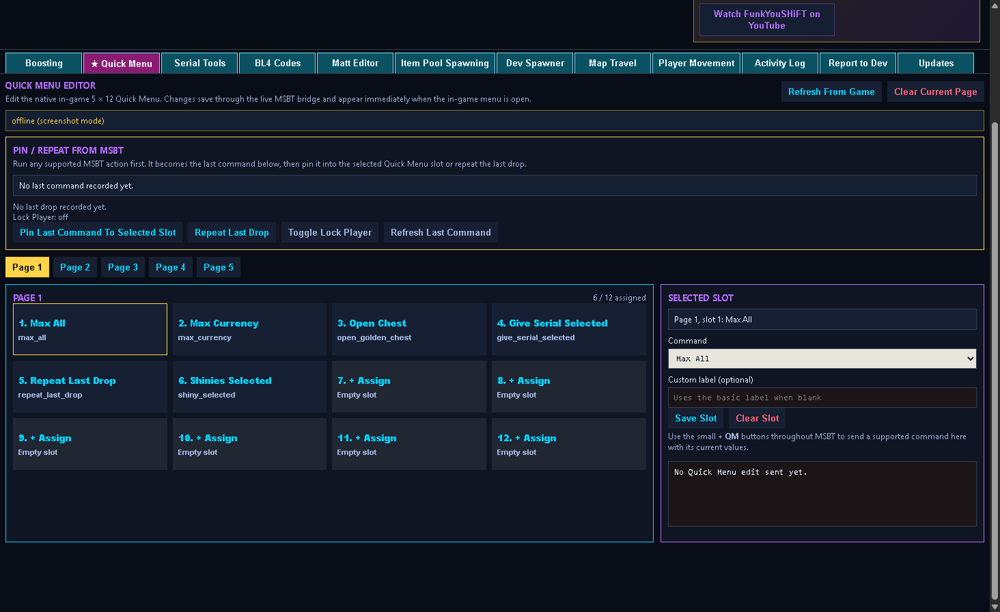
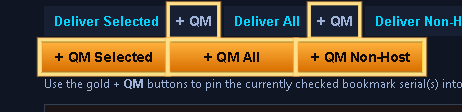
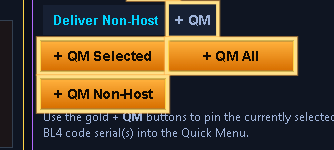
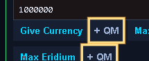

# Matt's SDK Boosting Tools (MSBT)

MSBT is a Borderlands 4 boosting and item toolkit: a standalone Windows app outside the game, plus a small SDK mod that talks to Borderlands 4 while you play. Use it for currency/XP/SDU helpers, serial delivery, BL4 code browsing, Mattmab’s save/profile/item editor, Dev Spawner, map travel, movement tools, and more.

**Current release: [v2.1.0](https://github.com/funkyoushift/MattsSDKBoostingTools/releases/tag/v2.1.0)**

This project is **unofficial**. It is not affiliated with, endorsed by, or connected to Gearbox, 2K, or the Borderlands franchise owners.

---

## Download & install (start here)

**Recommended:** grab the latest Windows installer from GitHub Releases:

[](https://github.com/funkyoushift/MattsSDKBoostingTools/releases/latest)
[](https://github.com/funkyoushift/MattsSDKBoostingTools/releases/latest)

- [GitHub Releases — download page](https://github.com/funkyoushift/MattsSDKBoostingTools/releases)
- Latest installer example: `MSBT-Installer-v2.1.0.exe`

**Portable option:** if you do not want an installer, download the portable ZIP instead (`MSBT-Portable-v…-win-x64.zip`), extract it, and run the app from that folder.

Counts above track **installer** and **portable ZIP** downloads only (not update-check files).

**Requirements**

- Borderlands 4 on PC (Windows)
- [oak2-mod-manager **v0.3**](https://github.com/bl-sdk/oak2-mod-manager/releases/tag/v0.3) (SDK 03)

Install / update the mod manager **before** you rely on MSBT live actions. Older SDK 02 setups are not the target for current builds.

Ignore `latest.json`, `latest.yml`, and `.blockmap` files unless you know why you need them — those are for the update system.

Site / tools: [FunkYouSHiFT.com](https://www.funkyoushift.com/) · [Tools page](https://www.funkyoushift.com/borderlands-resources.html)

---

## What MSBT does

In plain terms, the Electron app is the control panel. The SDK mod does the live work in-game.

<p align="center">
  
</p>

- **Quick Menu** — native in-game F7 menu (no BLImGui required) with pin/repeat/lock, plus an external Quick Menu editor tab and `+ QM` pin buttons
- **Boosting** — cash, Eridium, XP/spec, SDU, inventory size helpers, rarity drop weights, lobby targeting (selected / all / non-host), and UVH booster controls
- **Serial tools** — paste, validate, bookmark, and deliver `@U` item serials
- **BL4 Codes** — search/browse a merged local catalog (GZO image cards, Lootlemon references, custom/static codes), then deliver from a sticky delivery panel
- **Matt Editor** — hosted Mattmab save/profile/item editor workflow with MSBT delivery buttons
- **Item Pool Spawning** — browse and spawn from item pools through the bridge
- **Dev Spawner** — actor/AI spawn helpers (needs the bundled ActorScriptDeployer support mod)
- **Map Travel / Player Movement** — expanded station/map catalog, renamable travel favorites, and movement tools
- **Activity Log / Report / Updates** — see what ran, file issues, check for new builds, install/update the bundled SDK mod

<p align="center">
  
</p>

<p align="center">
  
</p>

A lot of community testing, late nights, and real money went into keeping this usable after the SDK v0.3 break. Tips help, but the tool stays free for normal community use under the license below.

---

## Quick Menu (v2.0)

Native in-game menu plus an external editor. **BLImGui is not required.**

<p align="center">
  
</p>

**In-game controls**

| Key | What it does |
| --- | --- |
| **F7** | Open **and** close the Quick Menu |
| **Esc** | Close a popup/modal first; if none, close the menu |
| **F6** | **Unstuck** — force-close the menu and restore normal mouse / look / move if input feels stuck |

Also use the on-screen **Close F7** button. Prefer F7 for normal open/close; use F6 only when the cursor or camera feels stuck after the menu.

**What you get**

- Up to **5 pages × 12 slots**
- **Pin Last Command**, **Repeat Last Drop**, optional **Lock Player**
- Edit mode: assign, clear, swap, reset page / reset all
- Live sync with the Electron **★ Quick Menu** tab over the bridge

<p align="center">
  
</p>

**How to pin commands from the app**

1. Run or configure an action in MSBT (Boosting, Serial Bookmarks, BL4 Codes, Travel, etc.).
2. Click a **`+ QM`** button next to that action (gold buttons on serial/BL4 delivery; smaller `+ QM` beside many Boosting actions).
3. Choose a page and slot → **Save**.
4. Press **F7** in-game — the slot is live (no game restart needed for layout edits).

<p align="center">
  
</p>

<p align="center"><em>Serial Tools → Bookmarks delivery: gold <strong>+ QM Selected / All / Non-Host</strong></em></p>

<p align="center">
  
</p>

<p align="center"><em>BL4 Codes → Delivery panel: same gold <strong>+ QM</strong> buttons</em></p>

<p align="center">
  
</p>

<p align="center"><em>Boosting: small <strong>+ QM</strong> pins next to supported actions</em></p>

---

## Why this project exists

Mattmab put the original toolset together: homemade SDK pieces plus community mods that fit Borderlands 4 boosting and item work. That first version lived **inside** the game through **BLImGui** (Borderlands ImGui) — a separate in-game UI framework, not Mattmab’s project. It worked, but running a full panel inside the engine was heavy; it competed with the game for the same resources.

That stack targeted **oak2-mod-manager v0.2**. When **v0.3** landed, a lot of old hooks and assumptions stopped lining up. Matt also had personal stuff going on and stepped back.

**FunkYouSHiFT** picked the project up to:

- move the main UI **out** of the game engine
- rebuild it as a standalone **Electron** app
- update the SDK-side mod for **oak2-mod-manager v0.3**
- keep an **HTTP bridge** between the app and the in-game mod
- preserve the useful workflows from the old BLImGui toolset
- fold in other community tools that fit (UVH booster workflow, GZO/Lootlemon catalog paths, and so on)

The older Tkinter app is still in the repo as legacy/reference. New work targets Electron.

---

## How it works (simple version)

```text
[ Electron app ]  --HTTP bridge-->  [ MSBT SDK mod in Borderlands 4 ]
   UI, catalogs,                    live give/spawn/travel/boost
   editor host,                     actions for the loaded session
   local tools
```

- **Electron** owns the UI, local resources, catalogs, bookmarks, validator, and Matt editor hosting. It does **not** import UnrealSDK / game modules.
- **The SDK mod** owns live game interaction.
- **The bridge** is how they talk.
- **BLImGui** is optional. You do not need it for the Electron app or the native F7 Quick Menu. If BLImGui is installed, the old-style in-game panel may still be available — that is optional, not required.

More architecture detail for developers: [docs/BLIMGUI_REPLACEMENT_ARCHITECTURE.md](docs/BLIMGUI_REPLACEMENT_ARCHITECTURE.md).

---

## Install steps

1. Install or update **[oak2-mod-manager v0.3](https://github.com/bl-sdk/oak2-mod-manager/releases/tag/v0.3)**.
2. Download **`MSBT-Installer-v….exe`** from [Releases](https://github.com/funkyoushift/MattsSDKBoostingTools/releases) (or extract the portable ZIP).
3. Run the installer. It installs the Electron app and copies into your Borderlands 4 `sdk_mods` folder (when it can find the game):
   - `MattsSDKBoostingTools.sdkmod`
   - `ActorScriptDeployer/` (needed for Dev Spawner)
4. Launch **Borderlands 4** with the SDK loaded.
5. Launch **Matt's SDK Boosting Tools**.
6. Hit **Refresh Status**, pick a target player if you need one, then use the tools.

If Steam/BL4 is in a non-standard place, open the **Updates** tab, browse to your `sdk_mods` folder, and run **Install / Update SDK Mod**.

Expected game-side layout:

```text
Borderlands 4/
  sdk_mods/
    ActorScriptDeployer/
    MattsSDKBoostingTools.sdkmod
```

---

## Updates

- The app checks **GitHub Releases** for newer builds (Updates tab / Check Updates).
- After an **SDK mod** update, **fully restart Borderlands 4** before testing live actions. An Electron-only update is not enough if the in-game `.sdkmod` changed.
- Bookmarks, favorites, opacity, and other user settings live in the Electron user-data folder — not inside the install directory — so they should survive app updates.

Versioning rules: [VERSIONING.md](VERSIONING.md).

---

## Safety notes

- This is a **modding / boosting** tool. Treat it like one.
- **Back up saves** before save editing or anything you are unsure about.
- **Dev Spawner** and other debug-style tools can stress or destabilize a session. Use them carefully, especially in multiplayer.
- Selected-player serial delivery still uses a game reward-package workaround: it can produce extra base reward behavior for non-target players. Do not delete other players’ mail unless you are sure which package is which.
- If something looks wrong after an update, confirm the SDK mod version in the app header matches the release, then restart the game.

---

## Credits

Huge thanks to the people who built pieces of this, shared data, and helped prove it in real lobbies.

| Who | What |
| --- | --- |
| **Mattmab** | Original toolset, save/editor work, and the foundation this project grew from. [Ko-fi](https://ko-fi.com/mattmab) · [legit-builder](https://github.com/mattmab/legit-builder) |
| **FunkYouSHiFT** | Current maintainer: Electron app, bridge, SDK v0.3 migration, packaging/releases. [Site](https://www.funkyoushift.com/) · [Twitch](https://www.twitch.tv/funkyoushift/) · [YouTube](https://www.youtube.com/@Funkyoushift) · [Tip](https://streamlabs.com/funkyoushift/tip) |
| **BLImGui / Borderlands ImGui** | Original in-game UI framework used by the early MSBT panel. Credited separately — not a Mattmab project. |
| **apple1417 / BL SDK community** | oak2 / UnrealSDK ecosystem and tooling that make mods like this possible. [oak2-mod-manager](https://github.com/bl-sdk/oak2-mod-manager) · [Mod DB](https://bl-sdk.github.io/oak2-mod-db/) |
| **Ynot / GZO** | BL4 Codes site, catalog/API, and community code pipeline. [GZO Codes](https://save-editor.be/GZO/Borderlands4/Codes.html) · [GZO hub](https://save-editor.be/GZO/) · [Discord](https://discord.gg/4hGKAHdvp6) |
| **Levin / Lootlemon** | Lootlemon item/code references used in the catalog. [Lootlemon](https://www.lootlemon.com/) |
| **Azalea Asvail** | Azzy UVH Booster workflow adapted into the Boosting tab (MIT). Source credits **Pyrex** for UVH6/UVH7 challenge paths. |
| **Azzarock, Frag Em All, Tobgun, Crayons82.0** | Testing, feedback, item data, and community reports that caught real breakage. |
| **Everyone else** | Item-code authors and players who published lists, filed bugs, and shared serials — a lot of this only works because of public community work. |

Third-party notices and license details for bundled/adapted pieces: [THIRD_PARTY_NOTICES.md](THIRD_PARTY_NOTICES.md).

---

## Links

- [GitHub Releases](https://github.com/funkyoushift/MattsSDKBoostingTools/releases)
- [oak2-mod-manager v0.3](https://github.com/bl-sdk/oak2-mod-manager/releases/tag/v0.3)
- [GZO Borderlands 4 Codes](https://save-editor.be/GZO/Borderlands4/Codes.html)
- [Lootlemon](https://www.lootlemon.com/)
- [FunkYouSHiFT site](https://www.funkyoushift.com/) · [Tools](https://www.funkyoushift.com/borderlands-resources.html)
- [Tip FunkYouSHiFT](https://streamlabs.com/funkyoushift/tip) · [Donate to Mattmab](https://ko-fi.com/mattmab)
- [Report issues](https://github.com/funkyoushift/MattsSDKBoostingTools/issues)

---

## For developers

If you are building from source or digging into packaging, start here:

| Doc | Topic |
| --- | --- |
| [electron_poc/README.md](electron_poc/README.md) | Run/build the Electron app |
| [VERSIONING.md](VERSIONING.md) | SemVer, tags, installer names |
| [docs/BUILD_AND_PACKAGE.md](docs/BUILD_AND_PACKAGE.md) | Packaging notes |
| [docs/BLIMGUI_REPLACEMENT_ARCHITECTURE.md](docs/BLIMGUI_REPLACEMENT_ARCHITECTURE.md) | App vs SDK boundary |
| [docs/ELECTRON_ROADMAP.md](docs/ELECTRON_ROADMAP.md) | Current Electron priorities |
| [docs/NEXUS_RELEASE_SYNC.md](docs/NEXUS_RELEASE_SYNC.md) | Nexus file-list sync |
| [THIRD_PARTY_NOTICES.md](THIRD_PARTY_NOTICES.md) | Bundled third-party notices |

Quick build from repo root (Windows, Node/npm, Python 3.13 for tooling; the packaged app bundles a portable Python runtime for users):

```powershell
.\build_electron_beta.ps1            # unpacked build
.\build_electron_beta.ps1 -Installer # Windows installer + portable ZIP
.\publish_github_release.ps1         # upload assets to GitHub Releases
```

Repo layout in short:

- `mod_extracted/MattsSDKBoostingTools/` — SDK mod, bridge, live actions, optional BLImGui panel
- `electron_poc/` — Electron desktop app
- `external_app/v22_parts_codes_fixed/` — legacy Tkinter app, resources, Matt editor assets
- `docs/` — deeper developer notes

---

## License

Released under the [PolyForm Noncommercial License 1.0.0](LICENSE).

Personal / community modding use is fine under that license. Commercial use, resale, paid redistribution, or selling packaged builds needs separate written permission from Matt / FunkYouSHiFT.

Again: **not** official Gearbox / 2K / Borderlands software.
